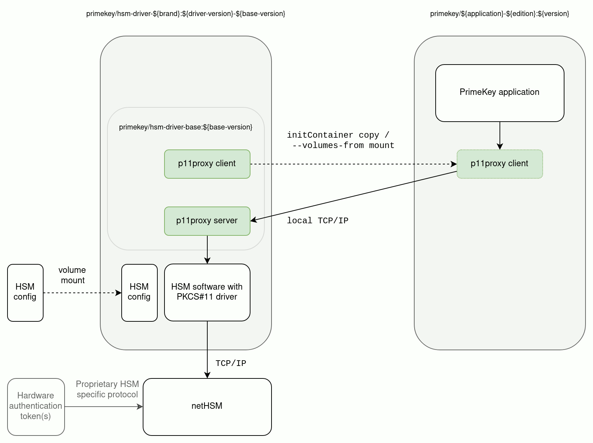

# HSM Integrations

## Drivers for Hardware Security Module (HSM) integration

The HSM PKCS#11 drivers are usually used with specific approved versions, and tested with the deployed HSM firmware version. Therefore it is difficult to include the correct drivers for specific users by default in containers. In addition, HSM manufacturer license may not allow to bundle and re-distribute the drivers with our containers.

With the above considerations, there is a need to be able to add specific HSM drivers to pre-packaged containers in an easy way.

### Non-PKCS#11 application level drivers

EJBCA EE supports both Azure Key Vault and AWS KMS via CryptoTokens and these can be configured via the UI without any additional rebuild.

### Adding PKCS#11 driver to another file system layer

By taking a release container and adding the PKCS#11 `.so` to the image, you can enable the use of the HSM driver.

This requires:
* a rebuild of the deployed image for every update of either the application or the HSM driver
* that the HSM library works with current OS libraries in the application release
* that the HSM library works with low privileges assigned to the application image at runtime

### Side-car pattern for Hardware Security Module (HSM) integration

EE application users can leverage a proprietary module packaged as a container to invoke the HSM specific PKCS#11 library over (Pod-local) network. This enables rolling updates of either hsm-driver or application container without the risk of application container library changes breaking the HSM driver.

This enables rolling updates of either hsm-driver or application container without the risk of application container library changes breaking the HSM driver.

See the provided hsm-driver examples on how this can be used.